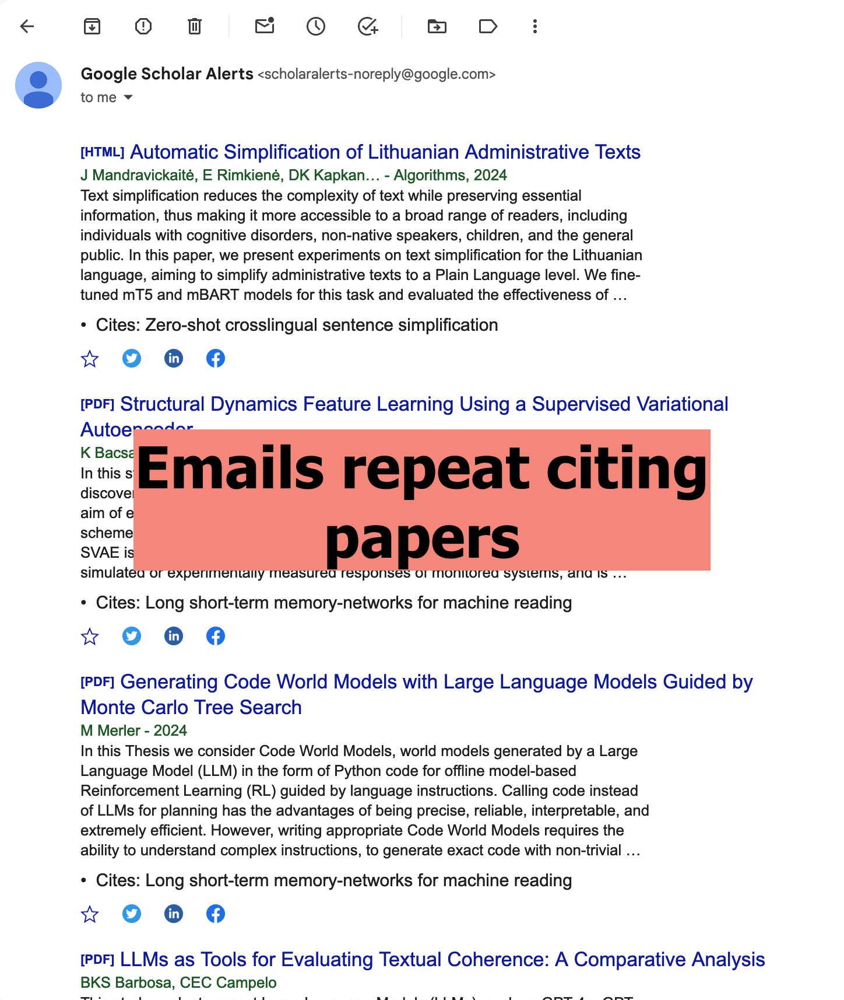
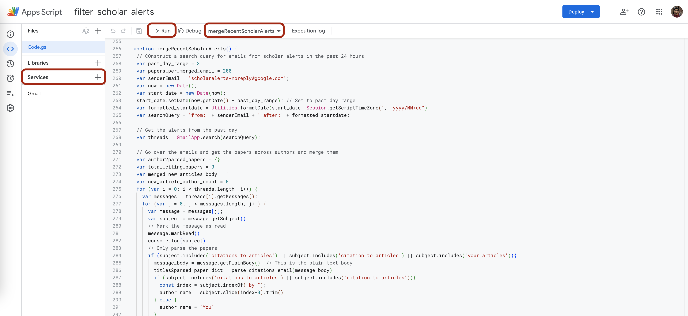

This is a script to create a simple "Digest" for the papers you receive in your subscribed Google Scholar Alerts. I'm wrote this to prevent the scholar alerts from overwhelming me and for making sure that I actually skim the latest papers from authors I've subscribed to. Hope it helps you too!

## Introduction

I use this script + the Apps Script Triggers to do two things:
- **De-duplicate and sort citations:** De-duplicate the papers citing multiple authors that I am subscribed to and sort them in the order of citation count to my subscribed authors.
- **Trigger the script to get a regularly timed digest:** Collate scholar alerts which are sent willy nilly into one "Digest" email sent to me at a regular interval, for example one Google Scholar Digest every 3 days.

**Before:** My inbox inundated with Google Scholar Alerts multiple times a week:

  
  

**After:** Emails with de-duplicated and sorted citations delivered as a regular digest:

  

## Usage

You need to set up this script as a Google Apps Script and set up the Trigger to run at a frequency you want. Setting up a Google Apps Script is straightforward and I'm copying and modifying the instructions from here: https://developers.google.com/gmail/api/quickstart/apps-script 

### Run this manually first:

I recommend you do this the first time you set this up so that you can authenticate the scripts for use with your GMail.

1. Create a new script by going to https://script.google.com/create

2. Copy the code in `filter-scholar-alerts.js` into the script editor.

3. Click **Save**.

4. Under the left hand side "Services" menu **Add** the GMail API.

5. **Run** the script with the `mergeRecentScholarAlerts` function selected in the top menu. When you do this the first time it you will need to **review the permissions** that the app requires i.e. reading your email and sending you an email. The app runs entirely on your account so there should be no privacy concerns. Also make sure it is on the account where you receive your Google Scholar Alerts.

This is what it looks like on my account:

  

### Running this automatically with a trigger

Next set up a Trigger to run this script automatically on a schedule.

1. From the left hand menu navigate to **Triggers**.

2. Click on **Add Trigger**. Then fill out the options here.
	1. See the values for "Choose which function to run" and "Choose which deployment should run" that I set up below - you should use the same. 
	2. You can setup the script to run at a different time than me though - because the script looks for alerts in the past 3 days I have two triggers. One to run on Monday between 3-4 am and another to run on Thursday 3-4 am (you need to create multiple triggers if you want this to run multiple times a week). Look at `mergeRecentScholarAlerts` and change `past_day_range` if you want to collate emails on a different schedule.

3. Click *Save*. 

Here is how my Monday trigger is setup.

  

Hope it works! If you run into problems please get in touch with me.

## TODOs

1. At present the script merges all "New Article" emails into one email. In future the script will de-duplicate and sort these emails too.