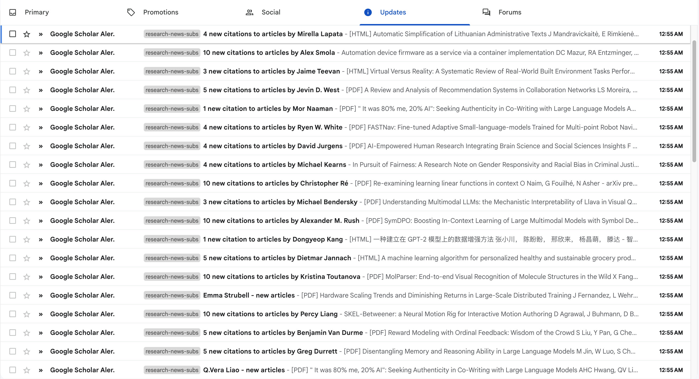

This is a script to collate the papers you receive in your subscribed Google Scholar Alerts. I'm hoping this will prevent me being overwhelmed by the emails I receive from Google Scholar and actually skim the latest papers from authors I've subscribed to.

I use this script to do two things:
- De-duplicate the papers citing multiple authors that I am subscribed to and sort them in the order of citation count to my subscribed authors.
- Collate scholar alerts which are sent willy nilly into one "Digest" email sent to me at a regular interval, for example one Google Scholar Digest every 3 days.

My inbox before and after this:

